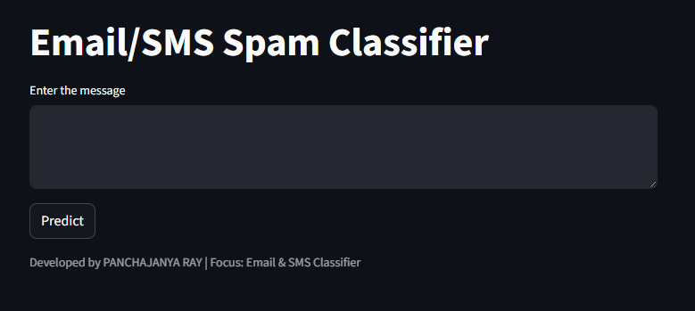
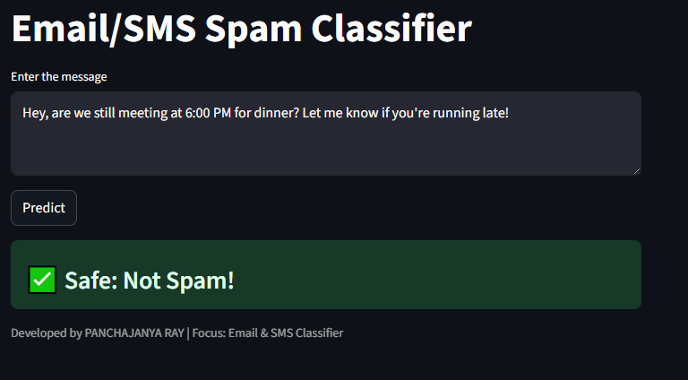
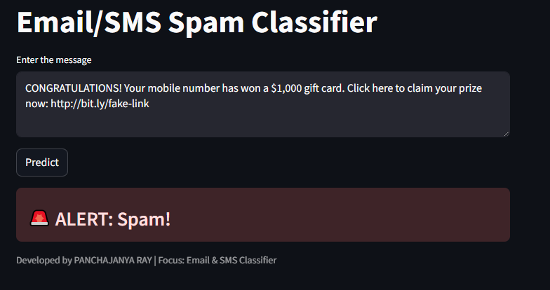

# 📧 Email/SMS Spam Classifier

A simple and interactive **Spam Detection Web App** built using **Streamlit** and **Machine Learning**. This project classifies messages as **Spam** or **Not Spam** using Natural Language Processing (NLP) techniques.

---

## 🚀 Features

* 🔍 Classifies SMS/Email text into **Spam** or **Not Spam**
* 🧠 Uses **TF-IDF Vectorization** and a trained ML model
* 🧹 Text preprocessing with:

  * Lowercasing
  * Tokenization
  * Stopword removal
  * Stemming
* 💻 Clean and interactive UI built with **Streamlit**

---

## 🛠️ Tech Stack

* Python
* Streamlit
* NLTK (Natural Language Toolkit)
* Scikit-learn (for model & vectorizer)
* Pickle (for model serialization)

---

## 📂 Project Structure

sms-spam-classifier/<br/>
│── data/<br/>
│ └── spam.csv<br/>
│<br/>
│── models<br/>
│ ├── model.pkl<br/>
│ └── vectorizer.pkl<br/>
│<br/>
│── notebook<br/>
│ └── sms-spam-detection.ipynb<br/>
│<br/>
│── screenshots/<br/>
│ ├── ham.png<br/>
│ ├── landingPage.png<br/>
│ └── spam.png<br/>
│<br/>
│── LICENSE<br/>
│── README.md<br/>
│── app.py<br/>
│── requirements.txt<br/>
└── sampleInputs.txt<br/>

---

## ⚙️ How It Works

1. User inputs a message (SMS/Email)
2. Text is preprocessed:

   * Converted to lowercase
   * Tokenized
   * Non-alphanumeric removed
   * Stopwords removed
   * Words stemmed
3. Processed text is transformed using **TF-IDF vectorizer**
4. Pre-trained model predicts:

   * `1` → Spam 🚨
   * `0` → Not Spam ✅

---

## ▶️ Installation & Setup

### 1. Clone the repository

```bash
git clone https://github.com/panchajanya-ray/spam-classifier.git
cd spam-classifier
```

### 2. Install dependencies

```bash
pip install -r requirements.txt
```

### 3. Download NLTK resources

```python
import nltk
nltk.download('punkt')
nltk.download('stopwords')
```

### 4. Run the app

```bash
streamlit run app.py
```

---

## 📸 Demo

* Enter a message in the input box
* Click **Predict**
* See whether it's **Spam** or **Safe**

---

## 🧠 Model Details

* Vectorizer: **TF-IDF**
* Algorithm: (depends on your trained model, e.g., Naive Bayes / Logistic Regression)
* Input: Preprocessed text
* Output: Binary classification


---

## 📌 Future Improvements

* Add model accuracy metrics in UI
* Support multiple languages
* Deploy on cloud (Streamlit Cloud / AWS / HuggingFace)
* Add dataset visualization

---

## 📸 Screenshots

### Main Interface


### Ham/ Not Spam Message


### Spam Message 



---

## 📜 License

This project is open-source and available under the **MIT License**.

---

## ✍️ Author

**Panchajanya Ray**
Focus: Email & SMS Spam Classification
